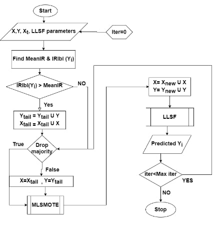

# LLSF-DL MLSMOTE Hybrid for Handling Tail Labels

> **Masters' thesis implementation with codes and datasets** 🤓  
> **Now available in both MATLAB and Python** 🐍

## Abstract


Labels with very few instances to learn from, called **tail-labels**, are a critical problem in multi-label classification that has garnered recent attention among researchers. This repository implements a hybrid approach that employs the MLSMOTE oversampling algorithm on tail instances to generate new labeled instances in-situ for the base classifier LLSF-DL, which is then retrained on the modified dataset. This provides a standalone solution for learning that takes care of class imbalance.



## 🚀 Quick Start

Choose your preferred implementation:

### 🐍 Python Implementation (Recommended)

**Prerequisites:**
- Python 3.8+
- NumPy, SciPy, scikit-learn

**Quick Setup:**
```bash
cd python_src
python -m venv .venv
source .venv/bin/activate  # On Windows: .venv\Scripts\activate
pip install numpy scipy scikit-learn pandas matplotlib seaborn tqdm
```

**Run Tests:**
```bash
python evaluate.py --test
```

**Quick Evaluation:**
```bash
python evaluate.py --quick demo minority
```

### 🔬 MATLAB Implementation (Original)

**Prerequisites:**
- MATLAB R2018b or later
- Statistics and Machine Learning Toolbox

**Setup:**
```matlab
cd src/
test_codebase()    % Validates all components
quick_eval()       % Quick evaluation
```

## 📁 Repository Structure

```
├── python_src/                    # 🐍 Python Implementation
│   ├── algorithms/
│   │   ├── llsf_dl.py            # LLSF-DL algorithm
│   │   └── mlsmote.py            # MLSMOTE algorithm
│   ├── utils/
│   │   ├── data_utils.py         # Data loading & processing
│   │   └── evaluation.py         # Evaluation metrics
│   ├── config.py                 # Configuration settings
│   ├── evaluate.py               # Main evaluation interface
│   ├── hybrid_approach.py        # Hybrid LLSF-DL + MLSMOTE
│   └── README.md                 # Python-specific documentation
├── src/                          # 🔬 Original MATLAB Implementation
│   ├── evaluate_llsf_mlsmote.m   # Main evaluation script
│   ├── quick_eval.m              # Simple evaluation interface  
│   ├── test_codebase.m           # Validation script
│   ├── QUICK_START_GUIDE.m       # Interactive usage examples
│   ├── config.m                  # Configuration settings
│   ├── plot_results.m            # Result visualization
│   ├── MLSMOTE.m                 # MLSMOTE algorithm
│   ├── Imbalance_ratio.m         # Imbalance calculation
│   ├── kfoldpartation.m          # Cross-validation utility
│   └── LLSF_DL_TKDE2016-Public/  # LLSF-DL implementation
├── results/                      # Generated experiment results
├── README.md                     # Project documentation
├── LICENSE                       # License information
├── flowchart.jpg                # Algorithm flowchart
└── tail_label.bmp               # Tail label illustration
```

### Supported Datasets
- `genbase.mat` - Text categorization (27 features, 32 labels)
- `emotions.mat` - Music emotion classification (72 features, 6 labels)  
- `rcv1-sample1.mat` - Reuters text categorization (47,236 features, 101 labels)
- `recreation.mat` - Recreation domain (606 features, 20 labels)

## ⚙️ Configuration

Modify `config.m` to adjust:
- Dataset selection
- Hyperparameters (α, β, γ, ρ)
- Number of folds and iterations
- MLSMOTE parameters

## 🆕 New Features

### Comprehensive Evaluation System
- **Single Command Evaluation**: Run complete experiments with `quick_eval()`
- **Automatic Comparison**: Compare different methods side-by-side
- **Result Visualization**: Automatic plot generation and metric tracking
- **Detailed Reporting**: Generate comprehensive evaluation reports
- **Demo Mode**: Test with synthetic data when real datasets unavailable

### Enhanced Code Quality
- **Input Validation**: Robust error checking and user feedback
- **Modular Design**: Clean separation of concerns and reusable functions
- **Documentation**: Comprehensive function headers and usage examples
- **Configuration Management**: Centralized parameter settings

## 🔬 Algorithm Overview

1. **Data Partitioning**: K-fold cross-validation setup
2. **Imbalance Detection**: Calculate imbalance ratios for each label
3. **MLSMOTE Application**: Generate synthetic samples for target labels
4. **LLSF-DL Training**: Train with augmented dataset
5. **Evaluation**: Multi-label performance metrics

## 📊 Results

The evaluation script automatically generates:

### Performance Metrics
- **Hamming Loss** - Lower is better
- **Ranking Loss** - Lower is better  
- **One Error** - Lower is better
- **Coverage** - Lower is better
- **Average Precision** - Higher is better
- **Macro/Micro F-measures** - Higher is better
- **Subset Accuracy** - Higher is better

### Output Files
- `results_*.mat` - Detailed numerical results
- `performance_results.png` - Visualization plots
- `evaluation_report_*.txt` - Comprehensive text report

### Sample Output
```
=== LLSF-DL + MLSMOTE Evaluation Results ===
Dataset: genbase
Key Performance Metrics (Final Iteration):
  Hamming Loss        : 0.0123
  Ranking Loss        : 0.0856
  Average Precision   : 0.8234
  Macro F-measure     : 0.7456
  Micro F-measure     : 0.8123
  Subset Accuracy     : 0.6789
```

## 📄 Citation

If you use this code in your research, please cite:

```bibtex
@mastersthesis{LLSF_MLSMOTE_Hybrid],
    title={LLSF-DL MLSMOTE Hybrid for Handling Tail Labels},
    author={Pradyumna Kumar sahoo},
    year={2024},
    school={Central University of Rajasthan},
    url = {https://1drv.ms/f/c/874353e620bf6fff/EvJ64XazvWpDs5V8bnOSqQwBkQ9BlTRFJU6rqrNV9iXbsQ?e=bAGCsm}
}
```

## 📜 License

This project is licensed under the terms specified in the [LICENSE](LICENSE) file.

## 🤝 Contributing

1. Fork the repository
2. Create a feature branch
3. Make your changes
4. Add tests if applicable
5. Submit a pull request

## 📞 Contact

For questions or support, please open an issue in this repository.
