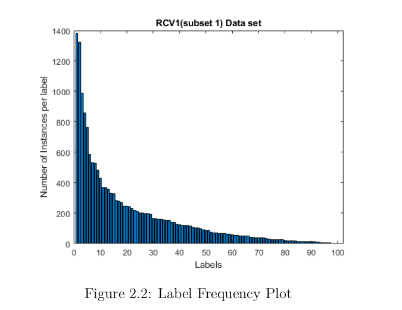

# LLSF_DL-MLSMOTE-Hybrid-for-handling-tail-labels :v:

> **My _Masters'_ thesis along with all codes and datsets.** :nerd_face:

## Abstract

> 

Labels with very few instances to learn from, called Tail-labels, is a critical problem faced
in multilabel classification that have garnered recent attention among researchers. Thus,
to improve learning, oversampling algorithm MLSMOTE is employed on tail instances to 
generate new labeled instances in-situ for our base classifier LLSF-DL which is retrained
on the modified dataset. This provides a standalone solution for learning of the classifier
taking care of class imbalance along the way.
